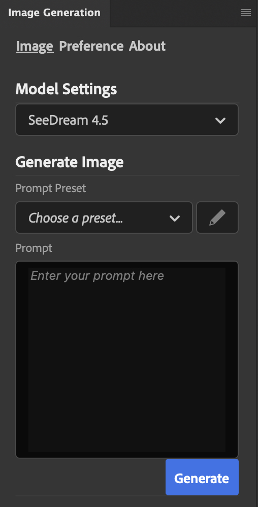
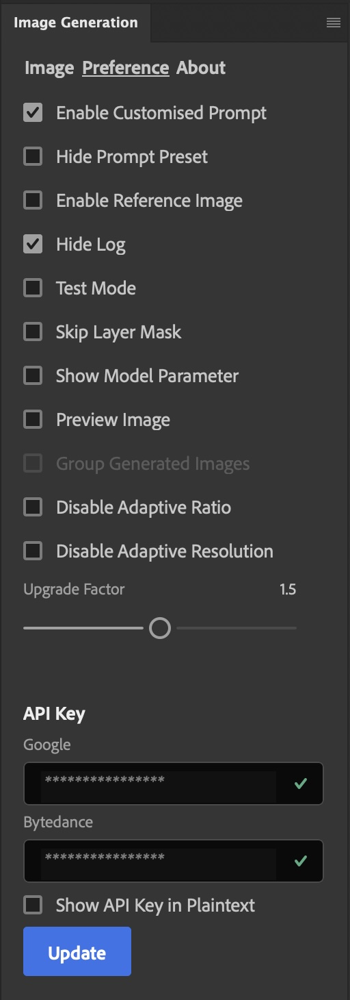

# AI-Assisted Image Editing for Photoshop

Bring state-of-the-art image generation and edits directly into Photoshop. This UXP plugin lets you select an area, describe the change, and generate results from leading cloud models without leaving your document.

## What this plugin does
- In-Photoshop generation on a selected region
- Supports multiple providers and models
- **4K** output from `Nano Banana Pro` and `SeeDream 4.5`
- Optional reference-image guidance
- Adaptive resolution selection for better quality vs. speed
- Places results into the current document as new layers

## Why you might want it
- Use free or cloud credits instead of running local GPUs
- Google provides **$300** in cloud credits
- ByteDance gives the first 200 generations free, then 20 free per day
- Keep your workflow in Photoshop instead of bouncing between apps
- Runs on older machines smoothly, e.g. on GTX1080, beacuse it compute on cloud
- **No ComfyUI needed**

## Supported models
- Google: Nano Banana Pro 3
- ByteDance: SeeDream 4.5
- xAI: Grok Imagine

## Quick start
1) Install the plugin by extracting source code into `Plug-ins` folder of your photoshop (**restart required**).
2) Open the panel and select a model.
3) Make a selection in your document.
4) Enter a prompt and click Generate.
5) Volla!

## API keys
Choose one or both:
- Google API key: [Google Vertex AI](https://cloud.google.com/vertex-ai?hl=en)
- ByteDance API key: [Volcengine](https://console.volcengine.com/ark/region:ark+cn-beijing/openManagement?LLM=%7B%7D&advancedActiveKey=model&tab=ComputerVision)
- xAI API Key: [xAI](https://console.x.ai/)

## Screenshots
### Main Page
<!--  -->

### Preference Page
<!--  -->

## Compatibility
- macOS
- Windows

## References
- [Photoshop API Documentation](https://developer.adobe.com/photoshop/uxp/2022/ps_reference/)
- [UXP API Documentation](https://developer.adobe.com/photoshop/uxp/2022/uxp-api/)
- [Image Editing Leaderboard](https://artificialanalysis.ai/image/leaderboard/editing/)

## License
GPL-3.0
